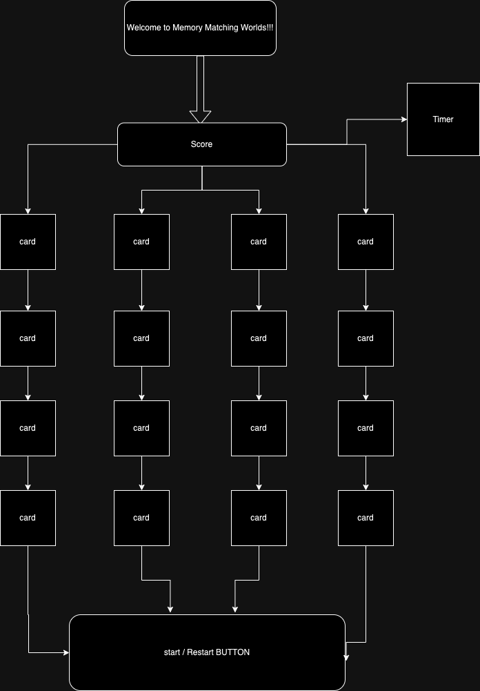
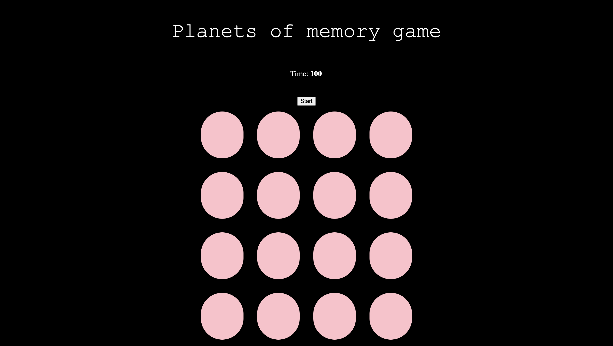
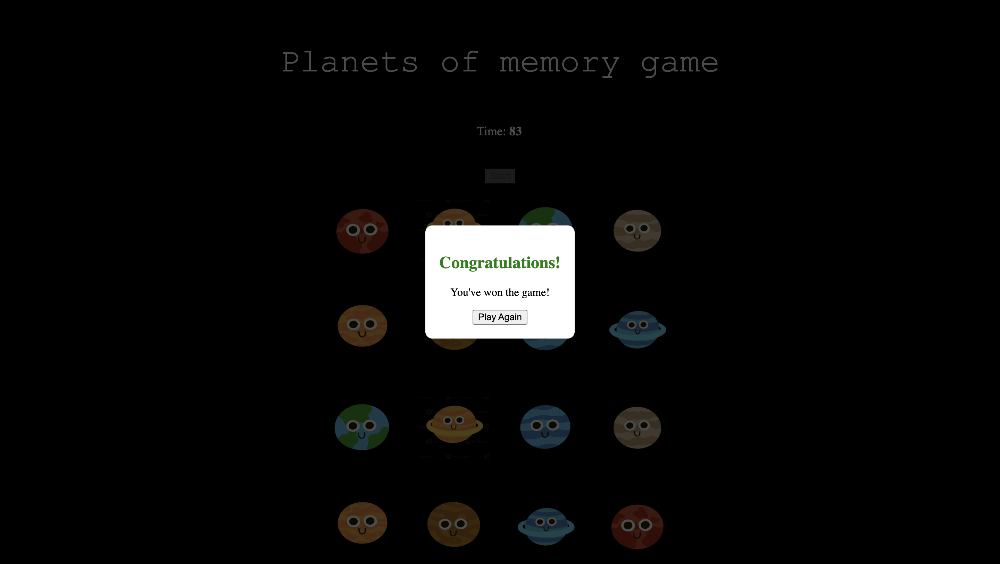
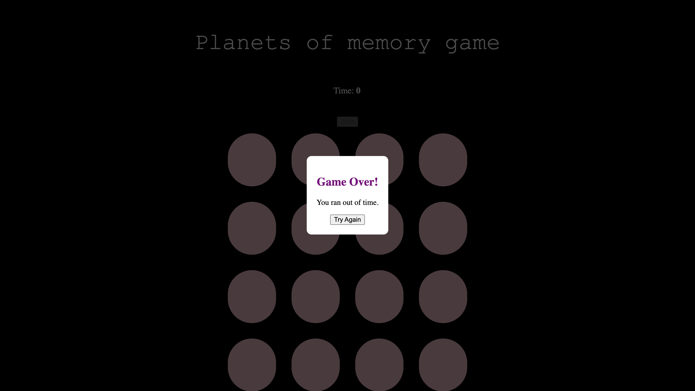

#  Matching Planets
 ---
## Getting Started
Down here is the link to my Project1 Game and all you have to do is click the link!
https://cgch19.github.io/memory-game/

 ---
## Memory Planets
Memory Matching Planets is a memory game . Players will be able to match the different planets in the solar system.This game will be simplistic which the wire frames will be intentionally kept simple, using basic shapes, lines, and placeholders to represent elements like buttons, text fields, images, and navigation menus.

---
### MVP Goals

- Create a 4x4 grid layout for the memory matching game. 
- Implement the core gameplay mechanics, allowing players to flip cards by tapping on them. 
Add logic to check for card matches when two cards are flipped. 
- Implement a win condition that checks if all card pairs have been matched. Display a victory message when the game is won. 
- Design and implement basic UI elements, including a  game board, and a victory screen.
- Include a simple button for start game. 
- Create a basic scoring system that tracks the time taken to complete the game.
- Use JavaScript, index,html, and style.css for my game

---
#### Stretch Goals
 -Timer Challenge Mode: Have a timer where players need to match cards within a set time limit, adding an element of urgency and excitement.
 -Simple Animations: Incorporate subtle animations for card flips and matches to make the game more visually appealing.

